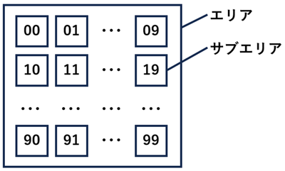
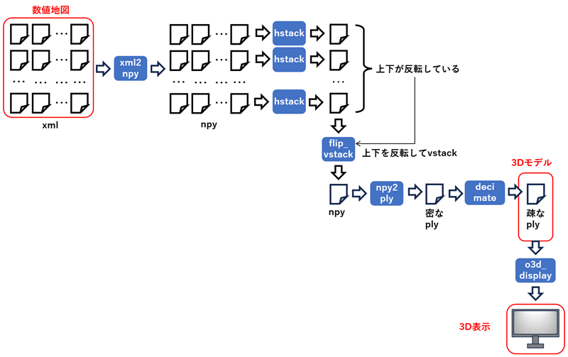
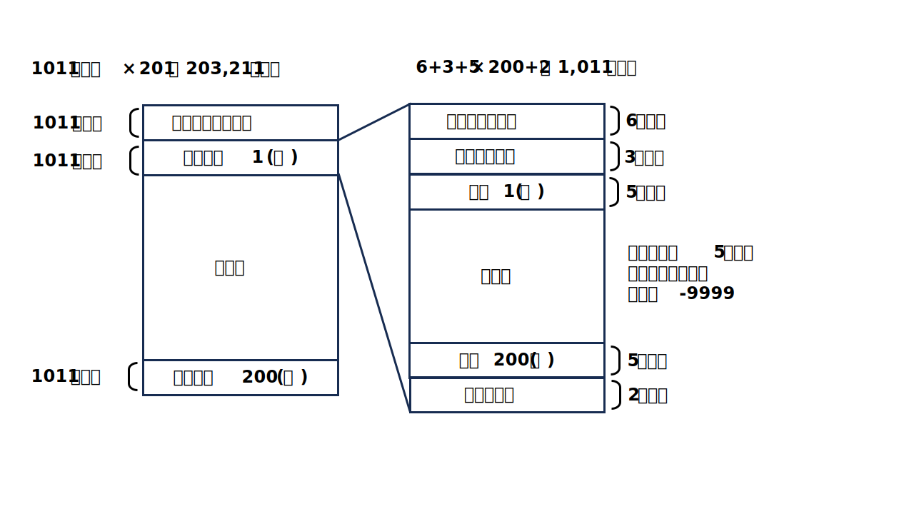

<html lang="ja">
    <head>
        <meta charset="utf-8" />
    </head>
    <body>
        <h1>
DigitalMap
</h1>
        <h2>なにものか？</h2>
        

            数値地図を3D表示するプログラムです。 
             
             
        

        <h2>環境構築方法</h2>
        

            pip install open3d opencv-python
        

        <h2>手順</h2>
        <h3>STEP.1 数値地図の入手</h3>
        

            国土地理院のホームページでアカウントを作成し、数値地図をダウンロードします。 
            詳細は <a href="https://www.gsi.go.jp/tizu-kutyu.html">国土地理院ホームページ</a> を参照してください。 
        

        <h3>STEP2: 数値地図の3Dモデル化</h3>
        

            選択したエリアが100個のサブエリアに分割されてxmlに格納されています。 
             
             
            以下の手順で3Dモデル化し、3D表示します。 
             
        

        <h4>STEP2-1: xml を numpy arrayに変換する (xmp2npy.py)</h4>
        

            サブエリアの高さ情報は FG-GML-******.xml というxmlファイルに格納されています。 
             
            サブエリアの大きさは 
　          &lt;gml:low&gt;0 0&lt;/gml:low&gt; 
　          &lt;gml:high&gt;224 149&lt;/gml:high&gt; 
            から、225×150 であることがわかります。 
             
            高さのデータは以下に格納されています。 
            &lt;gml:tupleList&gt; 
            その他,1483.60 
            その他,1481.80 
            その他,1479.30 
            その他,1477.80 
            その他,1476.10 
            その他,1474.20 
            その他,1473.10 
            　　　　： 
             
            ところどころに、 
            データなし,-9999. 
            があるので注意。周囲の高さで補間する必要があります。 
             
            手抜きをして、xmlをパースせず、テキスト置換で高さ情報を抜き出し、numpy array化します。 
             
            python src\xml2npy.py (数値データへのワイルドカード) 
             
            ・00.npy ～ 99.npy が出力されます。 
            ・ファイルの命名規則が変わったらコードの見直しが必要です 
            ・-9999は上下左右の値で補間しています。上下左右がすべて-9999の場合は、別の対応が必要になります。 
            ・高さデータは上→下ではなく、下→上の順に格納されているらしいので、後で上下を反転します。 
            ・エリア内に海や湖がある場合はどうなるか未確認です。 
        

        <h4>STEP2-2: 高さマップを横方向に連結する (hstack.py)</h4>
        

            100個の numpy array を10個ずつ、横方向に連結します。 
            連結した numpy array は hstack.npy に出力されるので rename します。 
             
            python src\hstack.py 0*.npy 
            ren hstack.npy 0.npy 
             
            python src\hstack.py 1*.npy 
            ren hstack.npy 1.npy 
            　：
             
            0.npy 1.npy ･･･, 9.npy が出来上がります。
        

        <h4>STEP2-3: 横方向に連結した高さマップを縦方向に連結します (flip_vstack.py)</h4>
        

            python src\flip_vstack.py [0-9].npy 
             
            結果は vstack.npy に出力されます。
        

        <h4>STEP2-4: numpy array を ply に変換します (npy2ply.py)</h4>
        

            python src\npy2ply vstack.npy 
             
            結果(密な3Dモデル)は vstack.ply に出力されます。
        

        <h4>STEP2-5: plyを間引きます (decimate.py)</h4>
        

            python src\decimate vstack.ply [(間引き率：デフォルト500)] 
             
            結果(疎な3Dモデル)は decimated_500.ply に出力されます。 
        

        <h4>STEP2-6: 3Dモデルを表示します (o3d_display_mesh.py)</h4>
        

            python src\o3d_display_mesh.py decimated_500.ply 
            <table border="1">
                <tr><th>操作</th><th>機能</th></tr>
                <tr><td>左ボタン押下＋ドラッグ</td><td>3Dモデルの回転</td></tr>
                <tr><td>ホイールボタン押下＋ドラッグ</td><td>3Dモデルの移動</td></tr>
                <tr><td>ホイール回転</td><td>3Dモデルの拡大・縮小</td></tr>
                <tr><td>PrintScreenキー押下</td><td>スクリーンショット保存</td></tr>
                <tr><td>ウィンドウ閉じるボタン押下　</td><td>プログラム終了</td></tr>
            </table>
        

        <h2>(備忘録)　50m数値地図</h2>
        

        　　昔購入した 50m数値地図のCD-ROMがあったので、numpy arrayに変換してみた。 
        　　python src\50mMap2npy.py (MEMファイルへのワイルドカード) 
             
        　　CD-ROMにファイルフォーマットの説明が入っているがわかりにくかったので絵にしてみた。 
        　　</a>
        

    </body>
</html>
